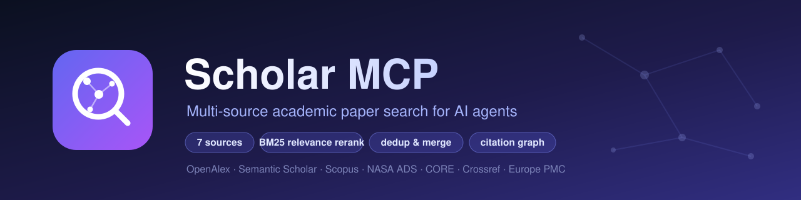
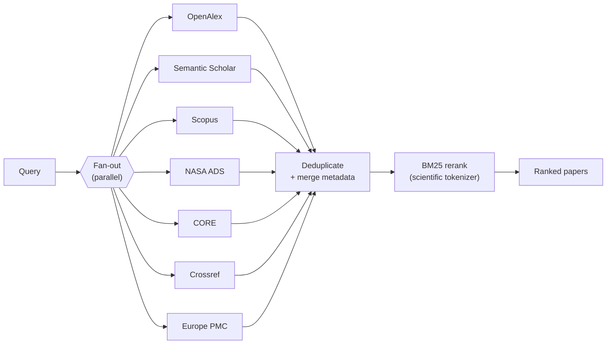

<div align="center">
  

  <p>
    <a href="#"></a>
    <a href="#"></a>
    <a href="#sources"></a>
    <a href="#how-it-works"></a>
    <a href="#license"></a>
  </p>

  <p><b>One search across seven scholarly databases — deduplicated, merged, and reranked by relevance.</b><br>
  An <a href="https://modelcontextprotocol.io">MCP</a> server that turns a natural-language query into a clean, ranked set of papers for your AI agent.</p>
</div>

---

## Why

Asking one academic API a question gives you one provider's view, in one provider's order. Scholar MCP fans your query out to **seven** sources at once, **deduplicates** the same paper arriving from multiple places, **merges** their metadata into one record, and **reranks** the whole set by relevance to your query with a scientific-domain BM25 model — so the most relevant papers float to the top regardless of which database they came from.

- 🔎 **Multi-source search** — OpenAlex, Semantic Scholar, Scopus, NASA ADS, CORE, Crossref, Europe PMC, in parallel.
- 🧮 **BM25 relevance reranking** — a scientific tokenizer (stemming + domain compound terms like `black_carbon`, `glacier_albedo`) ranks the merged set; the busiest provider no longer dominates the top.
- 🧹 **Smart deduplication** — DOI / source-ID exact match + fuzzy-title fallback, with preprint ↔ published collapsing (e.g. EGUsphere `-rc` reviewer comments).
- 🔗 **Citation graph** — citations and references for any paper.
- 🛟 **Resilient by design** — per-source rate limiting with adaptive backoff, transient-error retries, and graceful degradation (a down source never blocks the others).

## Sources

| Source | Documents | Coverage | API key |
|--------|-----------|----------|---------|
| [OpenAlex](https://openalex.org/) | 250M+ | All disciplines | Email only (polite pool) |
| [Semantic Scholar](https://www.semanticscholar.org/) | 200M+ | CS, biomedical, general | Optional (recommended) |
| [Scopus](https://www.scopus.com/) | 90M+ | Peer-reviewed journals | Required (Elsevier) |
| [NASA ADS / SciX](https://scixplorer.org/) | 30M+ | Astrophysics, Earth & planetary science | Required |
| [CORE](https://core.ac.uk/) | 290M+ | Open-access full text | Required (free) |
| [Crossref](https://www.crossref.org/) | 150M+ | DOI registry, all publishers | None |
| [Europe PMC](https://europepmc.org/) | 40M+ | Life sciences, Earth science, preprints | None |

> Only the sources you configure a key for are queried — the rest are skipped automatically.

## How it works



1. **Fan-out** — the query hits every configured source concurrently, each behind its own rate limiter.
2. **Deduplicate & merge** — papers are collapsed by DOI / source ID, then fuzzy title (preprint ↔ published aware); metadata from every source is merged into one record.
3. **Rerank** — the deduplicated set is scored with `BM25Okapi` over `title + abstract + keywords`, tokenized by a scientific tokenizer (Snowball stemming, scientific stop-word handling, multi-word term preservation). If the ranking dependencies are unavailable it degrades gracefully to the merged order.

## Installation

Requires Python 3.13+ and [uv](https://github.com/astral-sh/uv).

```bash
git clone https://github.com/tofunori/mcp-scholar.git
cd mcp-scholar
uv sync

# one-time: download the tokenizer data used by the reranker
uv run python -m nltk.downloader stopwords punkt
```

## Configuration

Create a `.env` file (see `.env.example`):

```bash
# Required — OpenAlex polite pool (your email)
OPENALEX_MAILTO=your.email@example.com

# Recommended — Semantic Scholar key (https://www.semanticscholar.org/product/api)
# Keyless works but is heavily shared-rate-limited; a key gives a dedicated 1 req/s quota.
S2_API_KEY=

# Required for these sources (each skipped if its key is absent)
SCOPUS_API_KEY=     # https://dev.elsevier.com/
SCIX_API_KEY=       # https://ui.adsabs.harvard.edu/user/settings/token
CORE_API_KEY=       # https://core.ac.uk/services/api
```

> **Crossref** and **Europe PMC** need no key. **Semantic Scholar** works keyless (shared rate limit). Everything else activates only when its key is set.

## Claude Code setup

Add the server to `~/.claude.json` (stdio):

```json
{
  "mcpServers": {
    "scholar": {
      "type": "stdio",
      "command": "uv",
      "args": ["--directory", "/path/to/mcp-scholar", "run", "python", "-m", "src.server"],
      "env": {
        "OPENALEX_MAILTO": "your.email@example.com",
        "S2_API_KEY": "your_s2_key",
        "SCOPUS_API_KEY": "your_scopus_key",
        "SCIX_API_KEY": "your_scix_token",
        "CORE_API_KEY": "your_core_key"
      }
    }
  }
}
```

An HTTP server (`src/server_http.py`) is also available for sharing one process across sessions.

## Tools

| Tool | Description |
|------|-------------|
| `search_papers` | Search across all configured sources; results are deduplicated and reranked by relevance. Supports `sources`, `limit`, `year_min`, `year_max`. |
| `get_paper` | Fetch a paper by DOI, OpenAlex ID, S2 ID, Scopus EID, ADS bibcode, PMID or Europe PMC ID. |
| `get_citations` | Papers that cite a given paper. |
| `get_references` | A paper's bibliography. |
| `get_similar_papers` | Similar-paper recommendations (Semantic Scholar). |
| `get_api_status` | Show which sources are configured and live. |

## Usage examples

```python
# Search across all sources (deduplicated + reranked)
search_papers("glacier albedo wildfire black carbon", limit=10)

# Restrict to specific sources
search_papers("MERRA-2 reanalysis", sources=["scix", "openalex"])

# Filter by year
search_papers("light-absorbing impurities in snow", year_min=2018, year_max=2024)

# Look up a paper and follow its citation graph
get_paper("10.1029/2022EF002685")
get_citations("10.1029/2022EF002685", limit=50)
```

> 💡 Two-to-four keywords work best: some sources (Scopus, ADS) AND every term together, so very long natural-language queries can over-constrain them. The reranker does the rest.

## Rate limits

| Source | Default rate | Notes |
|--------|--------------|-------|
| OpenAlex | 10 req/s | Polite pool (email) |
| Semantic Scholar | 1 req/s | Dedicated quota with a key; shared pool otherwise |
| Scopus | 2 req/s | ~20k/week (subscription-dependent) |
| NASA ADS / SciX | 5 req/s | 5,000/day |
| CORE | ~10 req/min | Free tier; transient 5xx auto-retried |
| Crossref | 10 req/s | Polite pool |
| Europe PMC | 8 req/s | Keyless |

## License

[MIT](LICENSE)
